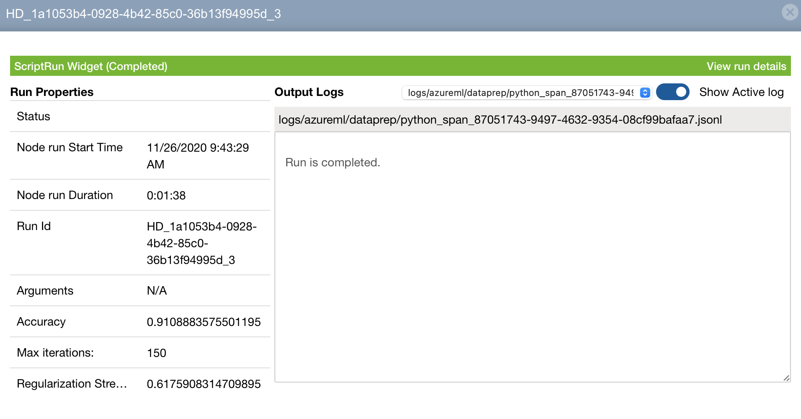
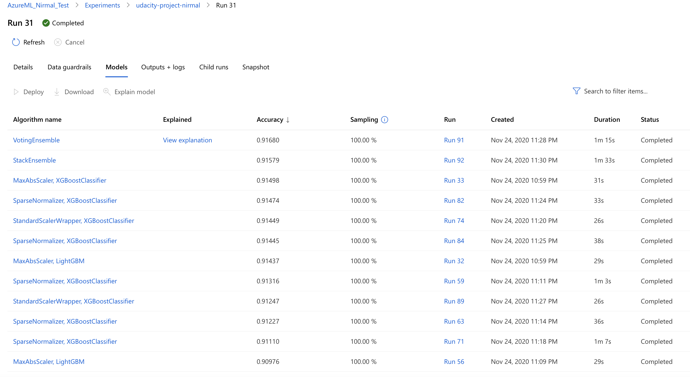
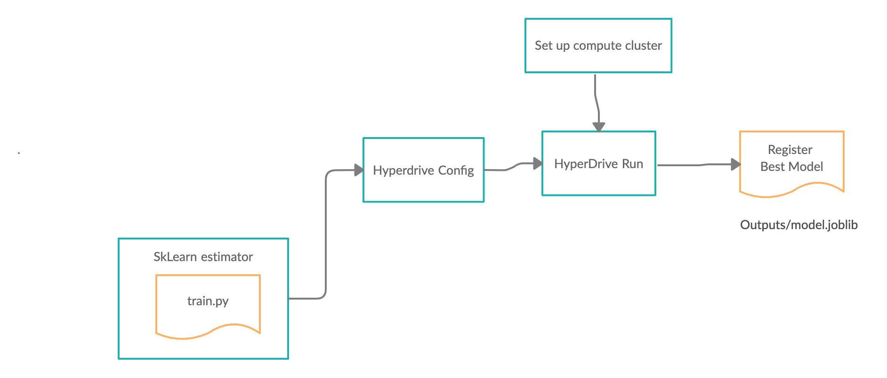

# Optimizing an ML Pipeline in Azure

## Overview
This project is part of the Udacity Azure ML Nanodegree.
In this project, we build and optimize an Azure ML pipeline using the Python SDK and a provided Scikit-learn model.
This model is then compared to an Azure AutoML run.

## Summary
This dataset contains marketing campaigns of a bank in which we can analyze the data , and build some predictive models to find new strategic ways to improve the future marketing campaigns, and target the right customers. The data is related with direct marketing campaigns of a banking institution. The classification goal is to predict if the client will subscribe to a term deposit (variable y).

I have used two different models as assigned by the project: 
1. Using the HyperDrive: Hyperparameters tuned are C (inverse regularization strength) and max_iter (maximum iterations allowed to converge). 
<a href ="https://scikit-learn.org/stable/modules/generated/sklearn.linear_model.LogisticRegression.html"> Link to Sklearn Logistic Regression. </a> Below is a snapshot of the best model selected using hyperdrive:  

2. Using AutoML: The automl runs different models with different parameters automatically, and picks the best model. <a href ="https://docs.microsoft.com/en-us/azure/machine-learning/concept-automated-ml"> Link to AutoML documentation from Microsoft. </a> The best model selected is VotingEnsemble. Below is the snapshot of AutoML run:  

## Scikit-learn Pipeline
**Explaination of the pipeline architecture, including data, hyperparameter tuning, and classification algorithm.**
The dataset is created using tabular data factory function from blobstorage. Train.py is the training script- that will be called from sklearn estimator. Logistic Regression model is being defined in the script. The parameters and policy is defined by hyperdrive config function.The next step is to submit the run. Below is the architecture of how the pipeline is set up: 

**What are the benefits of the parameter sampler you chose?**  
I have used random parameter sampling. In random sampling, hyperparameter values are randomly selected from the defined search space. It supports discrete and continuous hyperparameters. It also supports early termination of low-performance runs. Since random sampling selects random values from given range of values, the performance is fast, and therefore we can use random sampling for initial model run to test and then refine the search space with different values again. Grid search can be very resource expensive as it sweeps exhaustively over the search space.

**What are the benefits of the early stopping policy you chose?**  
I have selected bandit policy for early termination. It defines an early termination policy based on slack criteria, and a frequency and delay interval for evaluation. Again the main reason for this policy selection is performance and saving resources. Any run that doesn't fall within the slack factor or slack amount of the evaluation metric with respect to the best performing run will be terminated, thus saving the compute resource. Concretely, the configuration used in my hyperdrive config will evaluate jobs every 1 step and will terminate jobs that are not within 10 percent slack of the best performing job at that particular step. On larger models, this strategy typically saves significant compute time with no impact on the performance of the best model trained.

## AutoML  
The best model being selected and registered by AutoML is Voting Ensemble. A voting ensemble is an ensemble machine learning model that combines the predictions from multiple other models. One important parameter to consider and make sure is the experiment timeout. The autoML can sometimes may stuck in long runs during model optimization and selection, therefore it is important to control this parameter. 

## Pipeline comparison  
Comparing the accuracy, there is not much significant difference, as both predicts with accuracy around 0.91 percentage. AutoML provides more automation under the hood, and it can select different models, while hyper drive provides more controls of the parameters, but the limitation is that we have to predefine the model in script, and we are limited to use that model. 

## Future work
**What are some areas of improvement for future experiments? Why might these improvements help the model?**  
The scope of this project is to complete the process and compare two modeling approaches. Some of the improvements I would have done given more time are:
1. Spend more time on EDA (exploratory data analysis) to understand the input variables more. 
2. Corelation analysis among input variables.
3. Spend more time on feature engineering: Some examples where we could improve feature engineering: The marital status has more types ( like divorced, and unknown) but our current script simply take it as binary (married or not). We could also bin the age and create age brackets as features. These are just couple examples that I have quickly thought of.

## Proof of cluster clean up
I have used my own dev-test subscription for the project, and deleted the clusters. Attached is the screenshot of deletion:  

